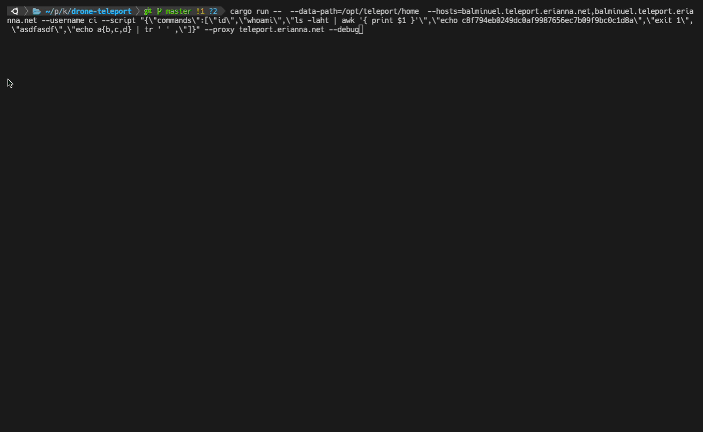
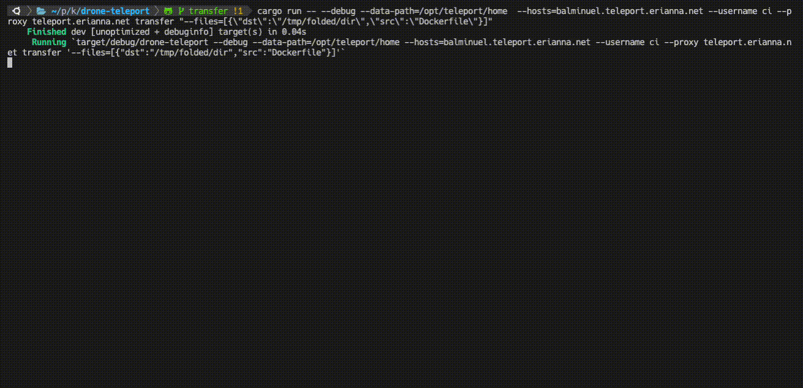
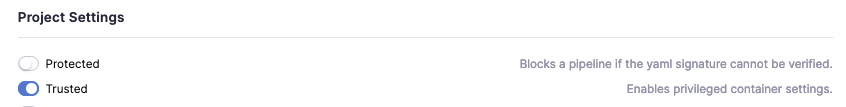

# Drone Teleport

A drone plugin for executing remote commands over SSH, through Teleport Machine IDs.

[](https://drone.erianna.com/charlesportwoodii/drone-teleport)
[](https://github.com/charlesportwoodii/drone-teleport/tags)
[](https://hub.docker.com/r/charlesportwoodii/drone-teleport)

> _This project is not sponsored, supported, or endorsed by Graviton or Teleport in any capacity._

## Drone Usage

This plugin supports two specific operations, defined by the `op` argument: `connect` and `transfer`.

> NOTE: Your Drone instance must have a working Teleport Bot / Machine ID configuration active and available at `/opt/teleport/home`, or elsewhere on disk, and must be mounted into the container. Take a look at the [Teleport Machine ID Getting Started Guide](https://goteleport.com/docs/machine-id/getting-started/) for more information on how to set this up.

### Connect



Connect is utilized to connect to an SSH target and run commands. Example arguments are as follows.

```yaml
volumes:
  - name: teleport-ssh
    host:
      path: /opt/teleport/home

steps:
  - name: "drone-teleport"
    image: charlesportwoodii/drone-teleport:latest
    volumes:
      - name: teleport-ssh
        path: /opt/teleport/home
    settings:
      op: connect
      proxy: teleport.example.com
      hosts:
        - host1.teleport.example.com
      username: ci
      data_path: /opt/teleport/home
      env:
        CUSTOM_ENV: "custom-env"
        CUSTOM_ENV2: "custom-env2"
      script:
        commands:
          - id
          - whoami
          - ls -laht | awk '{ print $1 }'
          - echo ${DRONE_COMMIT_SHA}
          - echo a{b,c,d} | tr ' ' ,
```

### Transfer



The `transfer` op may be utilized to transfer files from the source to the destination. Glob patterns are supported

Files are transfered in ~ 8Mb buffers. Multiple hosts are supported.

```yaml
volumes:
  - name: teleport-ssh
    host:
      path: /opt/teleport/home

steps:
  - name: "drone-teleport"
    image: charlesportwoodii/drone-teleport:latest
    volumes:
      - name: teleport-ssh
        path: /opt/teleport/home
    settings:
      op: transfer
      proxy: teleport.example.com
      compress: true
      compress_level: 13
      hosts:
        - host1.teleport.example.com
        - host2.teleport.example.com
      username: ci
      data_path: /opt/teleport/home
      files:
        - src: /path/to/file
           dst: /remote/file
        - src: /path/to/dir/*
           dst: /path/to/dir/
        - src: /path/**/*
           dst: /path/blob
```

> _drone-teleport_ will automatically create an archive of all files in _src_ and compress them for transfer using zstd. Make sure your remote `tar` program is at least version >=1.31 and has support for zstd built in. Compression is done with compression level of 13 by default and is configured via `compress_level` option, and can be disabled entirely by setting `compress` to false.

> NOTE: If you need to grab all files including hidden files, It's recommended to add a `depends_on` previous step that creates a single tar archive, then set that as the `src` instead of adding multiple src/dst file targets.
> NOTE: File transfer is destructive on the remote target. _drone-teleport_ will overwrite any existing files on the remote without warning. Make sure your _dst_ argument is valid before executing!

## Docker Usage

Execute from the working directory:

```bash
docker run --rm \
    -e PLUGIN_OP=connect|transfer
    -e PLUGIN_DATA_PATH=/opt/teleport/home \
    -e PLUGIN_HOSTS=host1.teleport.example.com,host2.teleport.example.com \
    -e PLUGIN_USERNAME=ci \
    -e PLUGIN_SCRIPT="{\"commands\":[\"id\",\"whoami\",\"ls -laht | awk '{ print $1 }'\",\"echo c8f794eb0249dc0af9987656ec7b09f9bc0c1d8a\",\"exit 1\", \"asdfasdf\",\"echo a{b,c,d} | tr ' ' ,\"]}" \
    -e PLUGIN_ENV="{ \"CUSTOM_ENV\": \"custom-env\" }" \
    -e PLUGIN_DEBUG=false \
    -e PLUGIN_PORT=3022 \
    -e PLUGIN_PROXY=teleport.example.com \
    -e PLUGIN_CLUSTER=teleport.example.com \
    -e PLUGIN_FILES="[{ \"src\": \"source-file\",  \"dst\": \"destination-file\"}]"
    -v${PWD-.}:${PWD-.} \
    -v${PWD-.} \
    -v/opt/teleport/home:/opt/teleport/home \
    charlesportwoodii/drone-teleport:latest
```

## Building

Binary can be built using `cargo`. Make sure you have the rust toolchain installed. `aarch64` and `amd64` architectures are both supported.

```bash
cargo build --release --target x86_64-unknown-linux-gnu
cargo build --release --target aarch64-unknown-linux-gnu
```

Docker image is managed via Drone pipeline, but can be built manually with [buildx](https://docs.docker.com/build/buildx/).

```bash
docker buildx build --platform linux/amd64,linux/arm64 -t charlesportwoodii/drone-teleport:latest  --no-cache .
```

> _NOTE:_ Reference the .drone.yml `Cargo Build` section for the appropriate packages for cross-compilings for `amd64` and `arm64`.

## Drone Repository Configuration

Please ensure that `trusted` mode is enabled in your drone repository settings to allow mounted volumes.



## Execution Notes

This plugin will execute commands in parallel for all listed servers and will stop on any error.
